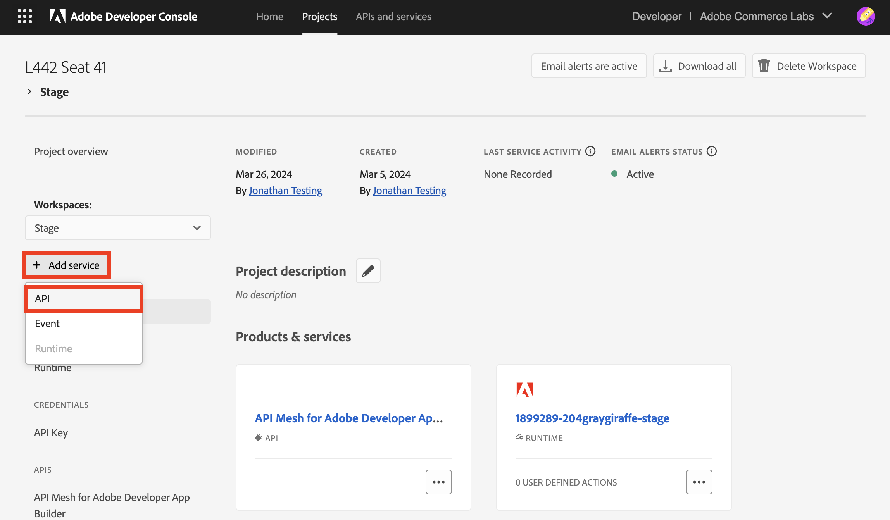
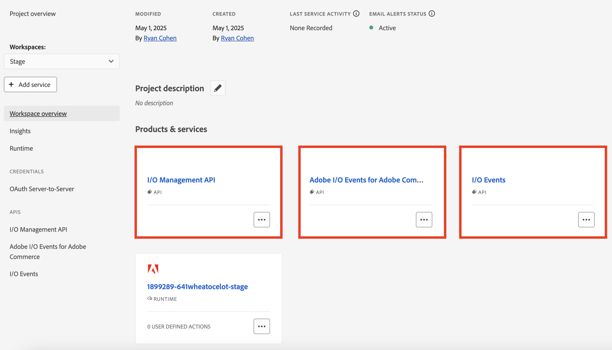
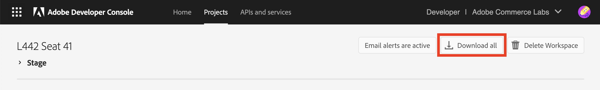
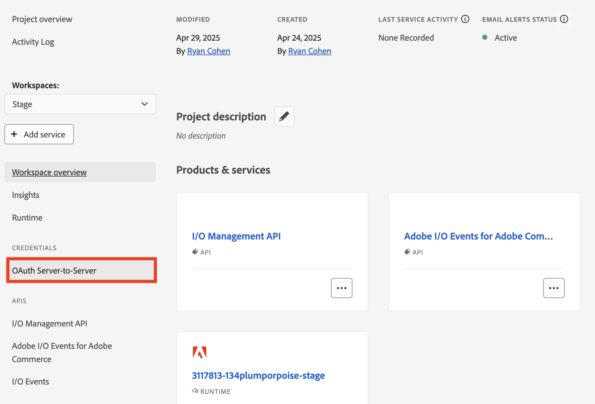
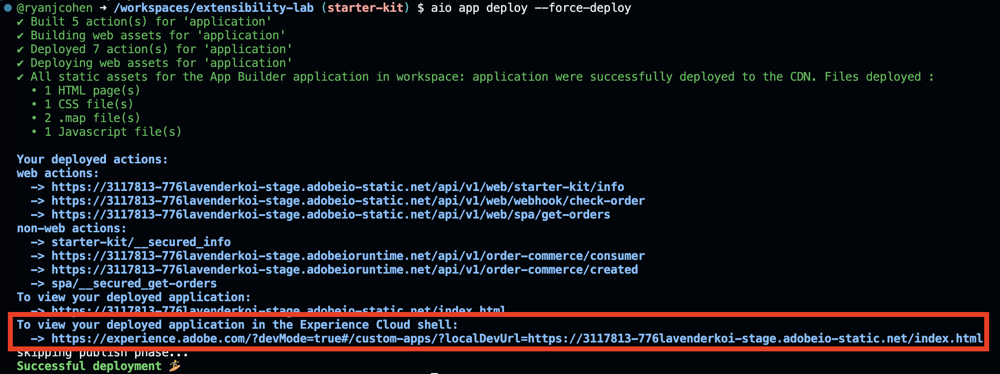
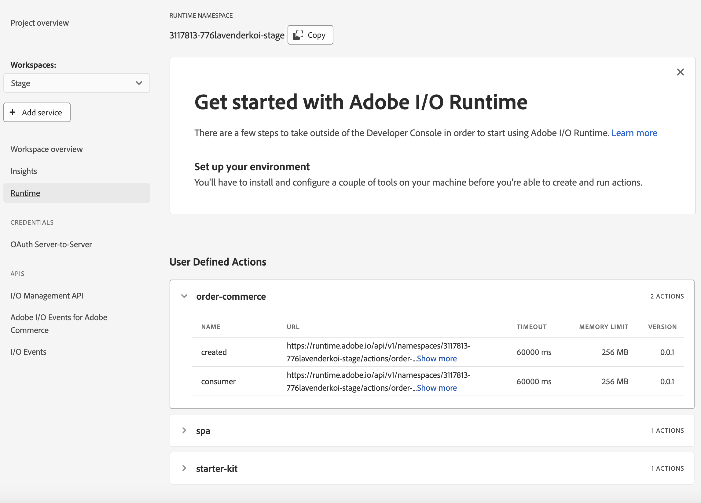
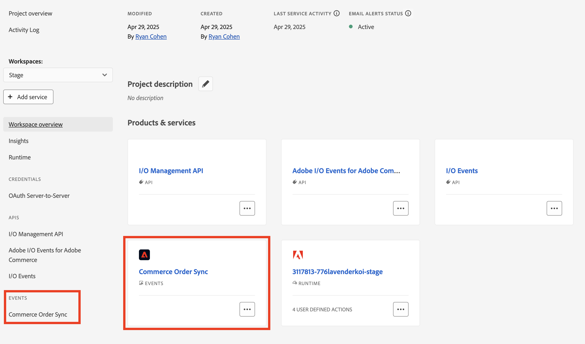
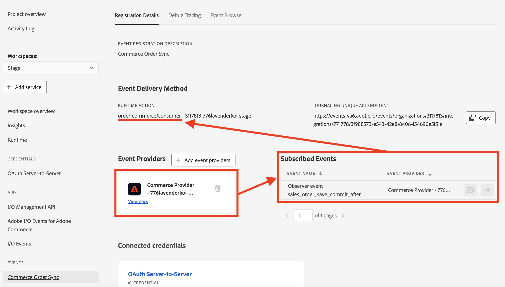
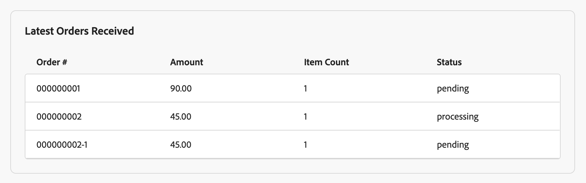

:exclamation: draft :exclamation:

# Commerce Partner Days - ACCS Session

https://github.com/rojoangel/extensibility-lab

## Codespaces Setup

### Login

1. Go to the Adobe Developer console: http://developer.adobe.com/console
        
    The Developer Console is the gateway to access all the services and tooling available as part of the Adobe Developer Ecosystem.

2. Login with the following credentials. You will find your assigned seat number on your desk.
```
Email: pd-sjc+<SEAT_NUMBER>@adobecreate.com
Password: TBD
```


3. Select `Adobe Commerce Labs` profile

4. After logging in, accept Terms and Conditions


### Setup
 
1. Visit https://github.com/rojoangel/extensibility-lab
2. Navigate to the top right of the page and click on the `Use this Template` button. Select the `Create a new repository` option to create a new repo with the template. 
3. This should launch the repo provisioning UI. Select your personal account as the owner and enter an appropriate name for the repo. Make the repo `Private` and click on `Create Repository` to create a repo from the template. 
4. Congratulations, you now have the tools to create and extend your own commerce store.
5. Click on the `Code` icon and select the `Codespaces` tab. Click on the `+` icon to create a new personal codespace. 
6. This will launch a new codespace on the repo. The initialization will take around 3-4 minutes. 
7. Once done, you will be able to interact with the online IDE. 
8. Navigate to the terminal and run the following command to clear the temporary github token:
```bash
unset GITHUB_TOKEN
```
9. Now lets connect the terminal to your personal Github account. Run the following command:
```bash
gh auth login
```
This should launch the login process. Select the appropriate options to log into your Github account.


Once done you should see the following on the login screen:


10. Now lets connect the terminal to your assigned Adobe IMS account. Run the following command in the terminal:
```bash
aio auth login
```
If you are asked to confirm your action to open an external website, click `Open`.


Since we have logged in earlier, the terminal should be able to pick up the session automatically. **If that did not work, follow the same steps as above to login.**

Once login is successful, you will see a redirect link, click on it.


You will see an error such as this:


No worries, make a note of the port number in the address bar, for instance:


Go to the ports tab next to the terminal in the Codespaces window


Look for an auto-forwarded port with the same port number as earlier from the error window. Once you identify the appropriate forwarded port, copy it.


Navigate back to the error window and replace `127.0.0.1:<PORT_NUMBER>` with the copied text, and click enter. This will connect the IMS login on the browser to the Codespaces terminal.


## Create Storefront

Congratulations on creating a codespace and completing the pre-requisite steps. Now comes the fun part, lets create a storefront and connect it to a Commerce instance using API Mesh.

1. Run the commerce scaffolder CLI
```bash
aio commerce init
```
2. Make sure the CLI has selected the right github account. If so, Enter `y`.
3. Enter a name that will be used as the name the storefront repo. Make sure it isnt used in the past.
4. Select the first template in the list `adobe-commerce/adobe-demo-store`
5. Select the second option, which will allow us to select an assigned instance `Pick an available Adobe Commerce tenant`
6. This will prompt us to select the Org. Select the `Adobe Commerce Labs` org and press enter
7. From the list of instances, select the instance assigned to you. You can search for your instance by typing `Cloud Service <SEAT_NUMBER>`
    - The instance will be followed by a URL formatted as `https://na1-sandbox.admin.commerce.adobe.com/<TENANT_ID>`. Record the tenant ID for later use in the lab.
8. From the list of projects, select the project assigned to you. You can search for your project by typing `TBD`
9. Select the Production workspace
10. This will connect the selected instance through an API Mesh on the selected Project and Workspace
11. In the next step if a browser tab isnt opened, go to this link https://github.com/apps/aem-code-sync/installations/select_target
12. Select the appropriate account to install the AEM Sync Bot and complete the login process if any
13. Select the option to only install on selected repositories. Enter the name of the repo from 2nd question in the dropdown and click save.
14. Go back to the terminal and click enter to move forward. At this point, the CLI will validate the code sync and continue with content cloning. This will take a minute or 2.
15. Congratulations, you have created your own Storefront. Copy the final details and save it for future reference.


## Storefront Walkthrough

1. Go to the preview link from the terminal. It should be something like this `https://main--{repo}--{owner}.aem.page/`
2. Go to a sample PDP page `https://main--{repo}--{owner}.aem.page/products/adobe-for-all-tee/ADB256`

## Mesh Extensibility (Phase 2)

### Stitch Ratings API with Adobe Commerce Backend

Lets stitch Commerce backend and Ratings API using API Mesh. In this section we will create a new `ratings` field on the Products query and implement it using the Ratings API.

Here is the sample Ratings API to use with the mesh: `https://ratings-api.apimesh-adobe-test.workers.dev`

Lets add the new Ratings API to the Mesh. Open the `mesh_config.json` and add the following config under the sources array.

```json
{
  "name": "Ratings",
  "handler": {
    "JsonSchema": {
      "baseUrl": "https://ratings-api.apimesh-adobe-test.workers.dev",
      "operations": [
        {
          "type": "Query",
          "field": "ratings",
          "path": "/",
          "method": "GET",
          "responseSample": "./sampleRatings.json"
        }
      ]
    }
  }
}
```

The above config references a file called `sampleRatings.json`. Lets create this file with the following contents:

```json
{
  "average": 2,
  "total": 807
}
```

### Define `rating` field on `products` query

At this point we have added the Ratings source to the mesh. Now lets create the `ratings` field on the `products` query. Add the following contents to the `mesh_config.json` file under `meshConfig`:

```json
"additionalTypeDefs": "type Rating { average: Int, total: Int } extend type SimpleProductView { rating: Rating }",
```

### Implement `rating` field on `products` query

The above code defined a new type called `Rating` and added it to the `SimpleProductView` under a new field called `rating`. Now lets implement that field using the new Ratings API. Create a new file called `ratingsResolvers.js` and add the following contents:

```js
module.exports = {
  resolvers: {
    SimpleProductView: {
      rating: {
        selectionSet: "{sku}",
        resolve: (root, args, context, info) => {
          return context.Ratings.Query.ratings({
            root,
            args,
            context,
            info,
            selectionSet: "{average, total}",
          })
            .then((response) => {
              return response;
            })
            .catch(() => {
              return null;
            });
        },
      },
    },
  },
};
```

Add the resolver file reference to the `meshConfig`:

```json
"additionalResolvers": ["./ratingsResolvers.js"],
```

### Deploy mesh changes

Finally, lets deploy the mesh config to publish the new changes:

```bash
aio api-mesh update mesh_config.json
```

This operation typically takes 30 seconds to a minute. To check the status of the update, run the following command:

```bash
aio api-mesh status
```

## Storefront Extensibility

Lets update the storefront to display ratings in PDP pages.

### Storefront Codespace Setup

Go to the new storefront repo created by the terminal. Use the codespaces setup instructions from earlier to start a new codespace on the Storefront repo. Wait for it to complete, typically takes around 2 minutes.

Once the codespace it ready, lets make code some chagnes to consume and display product ratings on the product pages.

### Query Product Ratings

Add the following block to the `overrideGQLOperations` array in `build.mjs` file:

```js
{
  npm: '@dropins/storefront-pdp',
  operations: [`
    fragment PRODUCT_FRAGMENT on ProductView {
      ... on SimpleProductView {
          rating {
            average
            total
          }
      }
    }
  `],
},
```

This piece of code will instruct the dropin to fetch additional data from the Mesh.

### Consume Product Ratings

Add the following field to the `ProductDetails` model in `scripts/initializers/pdp.js` on line 58:

```js
transformer: (data) => data,
```

This will instruct the model to pass the new data to the PDP block.

### Display Product Ratings

Finally, lets display the ratings. Go to `blocks/product-details/product-details.js` and add the following line in `Line 47` next to `product price div` to create a new `div` for product ratings:

```html
<div class="product-details__ratings"></div>
```

Next, on line 89, add the following code to select the new div and store the reference in a `const`

```js
const $ratings = fragment.querySelector('.product-details__ratings');
```

Lastly, use the stored reference to display product ratings. Add the following code on line 234:

```js
$ratings.append(`${product.rating.average} stars average (out of ${product.rating.total} ratings)`);
```

### Reload dropins

Run the following command to re-install the update dropins:

```bash
yarn install:dropins
```

And finally, start the server to load the storefront:

```bash
yarn start
```

Go to any PDP page to verify the changes.

## Adobe Commerce Integration Starter Kit (Phase 4)

The purpose of this exercise is to demonstrate sending events from Commerce to Adobe Developer App Builder. You will use a simplified version of the Adobe Commerce Integration Starter Kit to configure Commerce and an App Builder project, allowing for the sending of events about saved orders.

### 1. Configure the Starter Kit

1. Navigate back to the Adobe Developer Console at https://developer.adobe.com/console/. If prompted, login and select the **Adobe Commerce Labs** organization. 
    

1. Click **Projects** in the Developer Console top menu.

    

    Then select the project assigned to your seat: 

    **L442 Seat <SEAT_NUMBER>**

    *Tip: Use search to find your project*

    Select the **Stage** workspace.

1. Three services need to be added to this workspace to prepare for securely receive events from Adobe Commerce.

    Select **Add service** > **API**. Then select I/O Management API > Next > OAuth Server-to-Server > Save configured API

    

    Add the following API services, one at a time:
    - Repeat **Add service** > **API** > I/O Events > Next > Save configured API
    - Repeat **Add service** > **API** > Adobe I/O Events for Adobe Commerce > Next > Save configured API

    You should now see the three new API’s at the workspace level.

    

1. Download the workspace JSON configuration file by clicking on the **Download all** button on the upper right corner of the page.
    
    
    
    Save it as `workspace.json` in the `extensibility-lab/scripts/onboarding/config` directory.

1.  Navigate back to the lab files. Copy the `env.dist` file in the `extensibility-lab` directory as `.env` 
    ```bash
    cp env.dist .env
    ```

    Then configure the `.env` file with all the information required:

    - To find the values for the OAuth config variables, click **OAuth Server-to-Server** in the Developer Console Workspace overview page for the Stage workspace.

        

    - Set the REST endpoint for your ACCS instance as the value for the `COMMERCE_BASE_URL`. The endpoint should be in the following format: `https://na1-sandbox.api.commerce.adobe.com/<TENANT_ID>/`. Use the tenant ID you recorded while creating your Commerce storefront.

    - Fill in the `IO_CONSUMER_ID`, `IO_PROJECT_ID`, and values `IO_WORKSPACE_ID` using the downloaded `workspace.json` file and the commented instructions in the `.env` file.

1.	Link the project in the current directory to the project in the Adobe Developer Console by running the following commands in the terminal:

    ```bash
    # configure Adobe I/O CLI to use the Adobe Commerce Labs organization
    aio console org select

    # configure Adobe I/O CLI to use the project assigned to your seat
    aio console project select

    # configure Adobe I/O CLI to use the Stage workspace
    aio console workspace select

    # configure Adobe I/O CLI to use the previous selections for the current project
    aio app use --merge
    ```

1. Deploy the application:

    ```bash
    aio app deploy
    ```

    Take note of the link to the deployed application in the Experience Cloud shell. This will be used later in the lab.

    

    After running the command and clicking the **Runtime** tab in the Developer Console for your Stage workspace, runtime actions are visible.

    

### 2. Onboarding

The starter kit provides boilerplate code for synchronizing entities across systems and onboarding scripts to simplify setup. During installation, there are low/no manual activities required.

To ensure flexibility for the onboarding scripts, the starter kit code provides a few different JSON configuration files to match your business requirements. 


All the files were pre-configured for this lab. The most important files are described below:

- `scripts/onboarding/config/providers.json`

  Defines the providers required during the integration. The "key" field will reference the providers in other configuration files. The rest of the fields are descriptive.

  For this specific lab, we will focus on creating a Commerce provider for sending events to App Builder. Although not used for this specific case, the starter kit also supports creation of backoffice providers for sending information from backoffice systems to Commerce.

- `scripts/onboarding/config/events.json`

  Defines all the meaningful events that the integration needs to care about. For this lab, we'll focus on the `com.adobe.commerce.observer.sales._order_save_commit_after` event listed at the beginning of this file.
  
  If more events were required, we would specify them in this file. Although not used for this lab, the full starter kit also provides support for product, customer, and stock events.

- `scripts/onboarding/config/starter-kit-registrations.json`

  Defines the required event registrations that will be created in App Builder. For this lab, the file has been configured so that only a registration for order events from Commerce will be created. When the registration is created, order save Commerce events will trigger runtime action code that we've added in the `actions/order/commerce` directory to save order data within the App Builder app.

- `scripts/commerce-event-subscribe/config/commerce-event-subscribe.json`

  Defines the event names and fields that must be subscribed to in Adobe Commerce. Information for the `com.adobe.commerce.observer.sales._order_save_commit_after` that will be used in this lab is provided in this file.

Now it's time to realize the onboarding. Go to your terminal and run the following commands:
```bash
npm run onboard
```

After successfully running this command, an event registration within your Stage workspace will be visible in the Developer Console.





Then, to automatically subscribe to the order save Commerce event, go to your terminal and run
```bash
npm run commerce-event-subscribe
```

### 3. Send information from Adobe Commerce to App Builder

Navigate to the link for the deployed application in the Experience Cloud shell that was included in the console output after running the `aio app deploy` command. The application contains a single page UI with a panel labeled **Latest Orders Received**. The panel is initially empty, but a grid with information about saved orders will appear after Commerce order save events are received and saved by the App Builder app's runtime action. The grid refreshes at regular intervals, allowing for the display of new order information.

In the storefront for your Commerce instance, place at least one order. After Commerce order save events are received in App Builder, the panel in the app's UI will look similar to the following:



This demo App Builder app simply stores and displays received order information, but the action code for the app could also be modified to send information received from Commerce to a third-party back office system. Although not shown in this demonstration, the starter kit can additionally be used in setting up the synchronization of data from third-party back office systems to Commerce.
