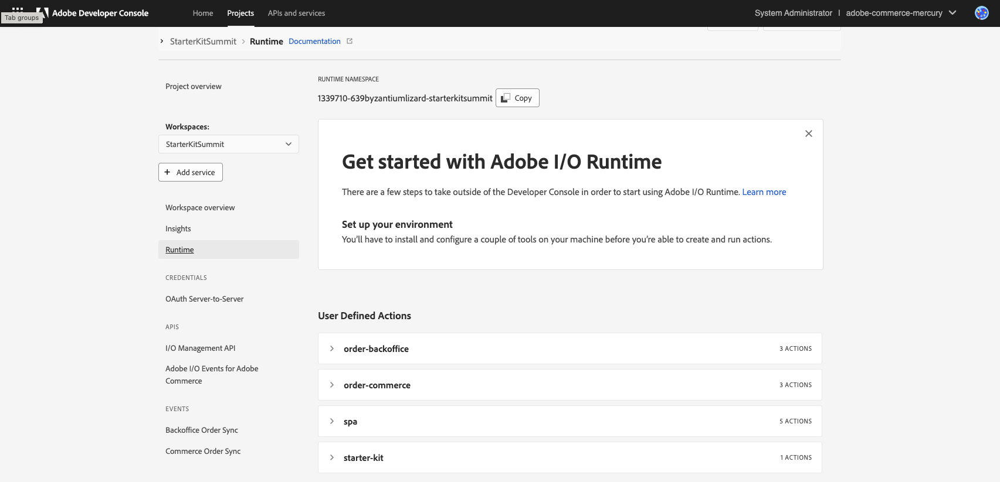
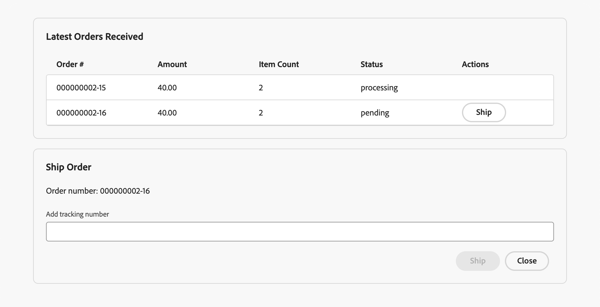

# Order Event Demo App

[](https://github.com/adobe/commerce-integration-starter-kit/actions/workflows/deploy_node_stage.yml)
  
* [Prerequisites](#prerequisites)
* [Application deploy & onboarding](#application-deploy--onboarding)
* [Using the application](#using-the-application)
* [References](#references)

This repo contains an [App Builder](https://business.adobe.com/products/experience-manager/developer-app-builder.html) application for demonstrating eventing and webhooks with an Adobe Commerce as a Cloud Service (ACCS) instance.

The application was intialized using the Adobe Commerce Integration Starter Kit. Public documentation for the Starter Kit can be found at [Adobe Developer Starter Kit docs](https://developer.adobe.com/commerce/extensibility/starter-kit/)

## Prerequisites

### Create App Builder project
Go to the [Adobe developer console](https://developer.adobe.com/console) portal
- Click on `Create a new project from template`
- Select `App Builder`
- Chose a name and title
- Select stage workspace or create a new one
- Add the following API services (select default Oauth server to server)
  - I/0 events
  - Adobe I/O Events for Adobe Commerce
  - I/O management API
- Download the [workspace configuration JSON](https://developer.adobe.com/commerce/extensibility/events/project-setup/#download-the-workspace-configuration-file) file and save it as `workspace.json` in the `./scripts/onboarding/config` starter kit folder because you will use it to configure Adobe IO Events in commerce afterward.

### OAuth Configuration
The application uses an OAuth credential to access ACCS APIs. Configure a new IMS OAuth Server to Server crednetial in App Builder following this [documentation](https://developer.adobe.com/developer-console/docs/guides/authentication/ServerToServerAuthentication/implementation/#setting-up-the-oauth-server-to-server-credential/)

Store the credentials in the `.env` file, these are the minimum required values:
```dotenv
OAUTH_CLIENT_ID=YOUR_CLIENT_ID
OAUTH_CLIENT_SECRET=YOUR_CLIENT_SECRET
OAUTH_SCOPES=['scope1', 'scope2']
OAUTH_ENV=prod
```

## Application deploy & onboarding
Follow the below steps to deploy and onboard the application in the repo for the first time. The onboarding process sets up event providers and registrations.

### Download the project
- Download and unzip the project
- Copy the env file `cp env.dist .env`
- Fill in the values following the comments on the env file.

### Configure the local application
Run the following command to build the `@adobe/commerce-sdk-auth` package:
```bash
npm run build
```

Install the npm dependencies using the command:
```bash
npm install
```

This step will connect your local application to the App builder project you created earlier.
Ensure to select the proper Organization > Project > Workspace with the following commands:
```bash
aio login
aio console org select
aio console project select
aio console workspace select
```

Sync your local application with the App Builder project using the following command:
```bash
aio app use
# Choose the option 'm' (merge) 
```

### Deploy
Run the following command to deploy the project; this will deploy the runtime actions needed for the onboarding step:
```bash
aio app deploy
```
You can confirm the success of the deployment in the Adobe Developer Console by navigating to the `Runtime` section on your workspace:


### Onboarding

#### Execute onboarding
This step will generate the IO Events providers and the registrations for the application. 
To start the process run the command:
```bash
npm run onboard
```

Check your App developer console to confirm the creation of the registrations:


### Complete the Adobe Commerce eventing configuration

#### Subscribe to events in the ACCS instance

Run the commerce-event-subscribe script to automatically subscribe to the Commerce event in `scripts/commerce-event-subscribe/config/commerce-event-subscribe.json`

```bash
npm run commerce-event-subscribe
```

# Using the application

The application contains a single page UI:


Orders successfully placed in the Commerce instance will appear in a table within the "Latest Orders Received" card when an "order placed" Commerce event is received by the application. Clicking the "Ship" button within an order's table row will open a "Ship Order" card. Entering a tracking number in the card's input field and clicking "Ship" will trigger creation of a shipment for the order with the specified tracking number in the Commerce instance.

# References
- [Adobe Commerce Extensibility](https://developer.adobe.com/commerce/extensibility/) 
- [Adobe developer console](https://developer.adobe.com/developer-console/docs/guides/)
- [Adobe App Builder](https://developer.adobe.com/app-builder/docs/overview/)
- [Adobe I/O Events](https://developer.adobe.com/events/docs/)
- [Adobe I/O Events for Adobe Commerce](https://developer.adobe.com/commerce/extensibility/events/)
- [Adobe I/O Runtime](https://developer.adobe.com/runtime/docs/)
- [Adobe Commerce as a Cloud Service APIs](https://developer.adobe.com/commerce/services/cloud/guides/)
